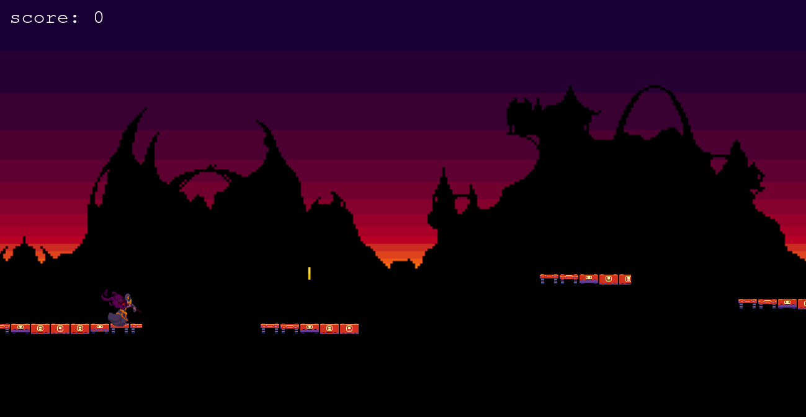

# Wizard Runner


## Table of Contents

<br />

* [About the Project](#about-the-project)
* [Built With](#built-with)
* [How to play](#how-to-play) 
* [Contributing](#contributing)
* [Contact](#authors)
* [Acknowledgements](#acknowledgements) 
* [Getting Started](#getting-started) 
* [Live Demo](#live-version) 

#
<br />

 <br/>
 <br/>


<br />

### Built With

* [JAVASCRIPT] [PHASER] [WEBPACK] [LEADERBOARD_API]

<br />

## Live Version

* [Live Demo](https://sergiocortessat.github.io/JSCapstone-PlatformGame/) 

<!-- ABOUT THE PROJECT   -->

<br />

## About The Project

- The Runner is an endless runner game where players run over some platforms and jump from ont platform to another.
- The burning fires are presented as obstacles which must be dodged in order to continue the game.
- There are also coins which can be collected to increase the score.  
- The game ends once the user falls down the platform or gets burned by the fire.
- You may find the original specifications for the game requirement can be found [here](https://www.notion.so/Platform-game-4a55a7d1fcc245bcb012c76814764712)

<br />

## How To Play

```
The rules for this game are rather simple
1. Tap or Click to jump.
2. Tap or Click again for a double jump
2. Jump and dodge the fire to stay alive.
3. Jump on the platforms and do not fall down.
4. Collect the coins to increase your score.

```

<br/>

## Screenshot

- Boot Scene

<p align="center">
  
</p>


- Login Scene

<p align="center">
  
</p>

- Menu Scene

<p align="center">
  
</p>


- Game Scene

<p align="center">
  
</p>


- GameOver Scene

<p align="center">
  
</p>


- Leader Board Scene
<p align="center">
  
</p>


- Credits Scene
<p align="center">
  
</p>


- Options Scene
<p align="center">
  
</p>

## Contributing

Contributions make the open-source community such an amazing place to learn, inspire, and create. Any contributions you make are **greatly appreciated**.

## Prerequisites

Terminal or similar to execute the program.


## Getting Started


## Clone project

- To get a local copy up and running follow these simple example steps.
- Clone this repository with git clone ```https://github.com/sergiocortessat/JSCapstone-PlatformGame/tree/feature``` using your terminal or command line.
- Change to the project directory by entering: ```cd JSCapstone-PlatformGame``` in the terminal.
- Enter the command npm i
- Enter the project folder and run locally by using npm start.
- If the project cant be build, please run npx webpack.

## Command line steps
```
- $ git clone `$ git clone https://github.com/sergiocortessat/JSCapstone-PlatformGame/tree/feature
- $ git checkout develop
- $ cd JSCapstone-PlatformGame
- $ npm i
- $ npm start
- ##(If project doesn't build, please run): $ npx webpack
```

## Testing

The testing has been performed using Jest Framework. 

- To run the test please open the command line
- Enter npm run test to run the testing once.
- Enter npm run watch to keep jest test open

```
- $ cd JSCapstone-PlatformGame
- $ npm run test
- $ npm run watch  (optional)

```


## Game Development
- The Game Design Document for this project can be found [here](assets/docs/GDD.md)

<br />

## Authors

👤 Sergio Cortes Satizabal

- Github: [@sergiocortessat](https://github.com/sergiocortessat)
- Twitter: [@sergiocortessat](https://twitter.com/sergiocortessat)
- LinkedIn: [@sergiocortessat](www.linkedin.com/in/sergio-cortes-satizabal-3b452194)


<!-- ACKNOWLEDGEMENTS -->
## Acknowledgements

* [Microverse](https://www.microverse.org/)
* [Phaser](https://phaser.io/)
* [OpenGameArt](https://opengameart.org/)
* [Game Art 2D](https://www.gameart2d.com/freebies.html)


## 📝 License

This project is [MIT](https://github.com/sergiocortessat/sergiocortessat/blob/main/LICENSE) licensed.


