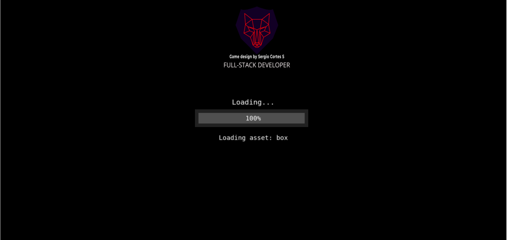
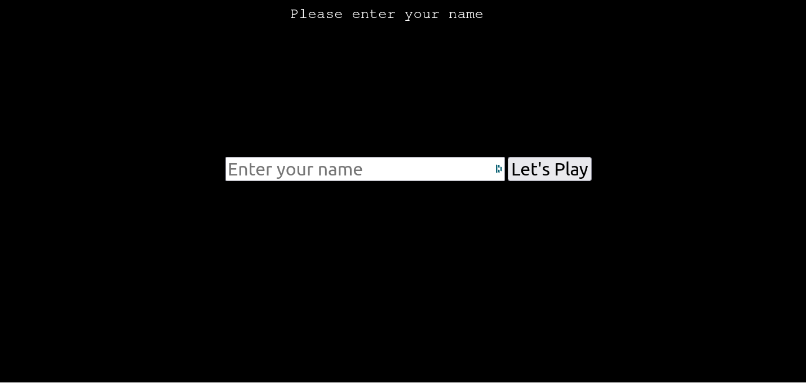
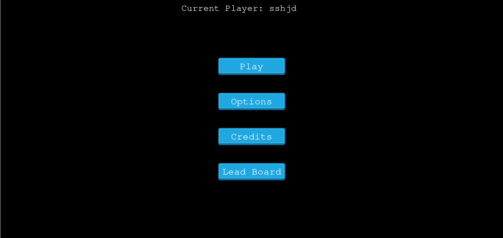
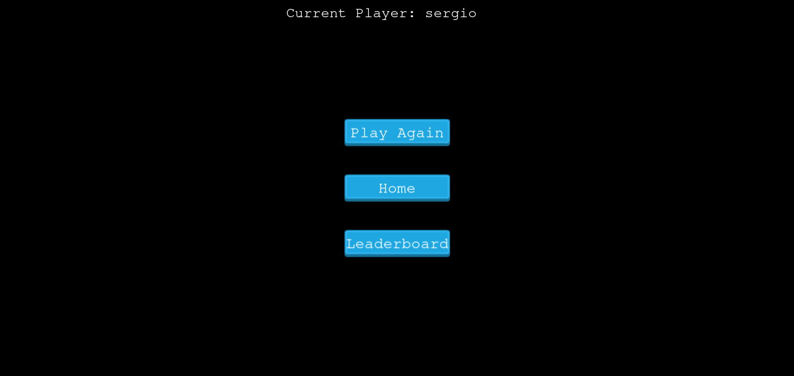
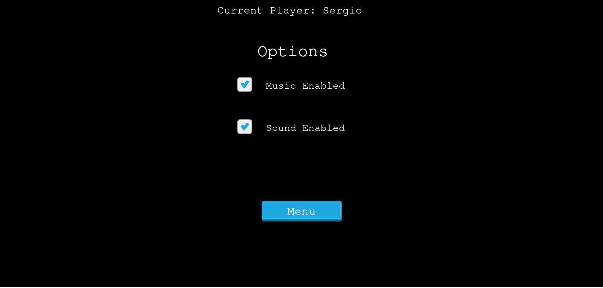

## Game Development
- This game has been developed in various stages. First of all, the basic knowledge about phaser 3 library, its instruction sets, and the working mechanism was obtained by visiting [phaser](https://phaser.io/) website, [phaser tutorials](https://phaser.io/tutorials/getting-started-phaser3), and [phaser documentation](https://photonstorm.github.io/phaser3-docs/).  
- The basic concept for this game has been taken from [this](https://www.emanueleferonato.com/tag/endless-runner/) tutorial.

- The game was developed in 5 working days using the following pattern:

  - Day 1: Learning about Phaser Library, following the tutorials, setup the development environment, and creating a basic template for the game.
  - Day 2: Designing the game, collecting the assets, and writing this GDD.
  - Day 3: Creating various scenes such as boot scene, preloader scene, title scene, etc. for the project including the main game scene and adding a player.
  - Day 4: Making the player jump, double jump, and adding fire as an obstacle and coins as collectible items.
  - Day 5: Prepare leaderboard feature with leaderboard API, testing game, fixing bugs, and deployment.

### Game Levels
- There are not any specific levels in the game, since it is the infinite runner game, the player is expected to run as far as possible jumping over the platforms, dodging the obstacles(fires), and collecting the coins.

### Assets
- The assets used in this game (sound effects, background music, animation sprites) have been take from [OpenGameArt](https://opengameart.org/), [Freesound.org](https://freesound.org/) and [Game Art 2D](https://www.gameart2d.com/freebies.html).

### Template

- The basic template of this game following the sequence of BootScene, PreloaderScene, LoginScene, TitleScene, OptionsScene, CreditsScene, GameScene, GameOverScene, and LeaderBoardScene has been implemented following [this](https://phasertutorials.com/creating-a-phaser-3-template-part-1/) tutorial.

### Login
- The implement the Login feature, [this](https://labs.phaser.io/view.html?src=src%5Cgame%20objects%5Cdom%20element%5Cinput%20test.js) tutorial has been followed.

### API
- The Score submission and LeaderBoard retrieval feature has been implemented using [this](https://www.notion.so/Leaderboard-API-service-24c0c3c116974ac49488d4eb0267ade3) API service.


### Character Information

- The character is called Dark Wizard, playing within a runner game.
- The character has the ability to run, jum and die.
- The character has a voice for a death status.

### Game Environment

- The main setup of Phaser is done with a screen size of 1300 * 600 Pixels
- The initial setup nof the game applies a 20% rate of fire and a 25% ratio of coins
- The setup allows the user to jump on a physical height of 450

### About The Game

- The Runner is an endless runner game where players run over some platforms and jump from one platform to another.
- The burning fires are presented as obstacles that must be dodged to continue the game.
- Coins can be collected to increase the score.  
- The game ends once the user falls down the platform or gets burned by the fire.
- You may find the original specifications for the game requirement can be found [here](https://www.notion.so/Platform-game-4a55a7d1fcc245bcb012c76814764712)


### How To Play

```
The rules for this game are rather simple
1. Tap or Click to jump.
2. Tap or Click again for a double jump
2. Jump and dodge the fire to stay alive.
3. Jump on the platforms and do not fall down.
4. Collect the coins to increase your score.
```

<br/>

## Screenshot

- Boot Scene

<p align="center">
  
</p>


- Login Scene

<p align="center">
  
</p>

- Menu Scene

<p align="center">
  
</p>


- Game Scene

<p align="center">
  
</p>


- GameOver Scene

<p align="center">
  
</p>


- Leader Board Scene
<p align="center">
  
</p>


- Credits Scene
<p align="center">
  
</p>


- Options Scene
<p align="center">
  
</p>